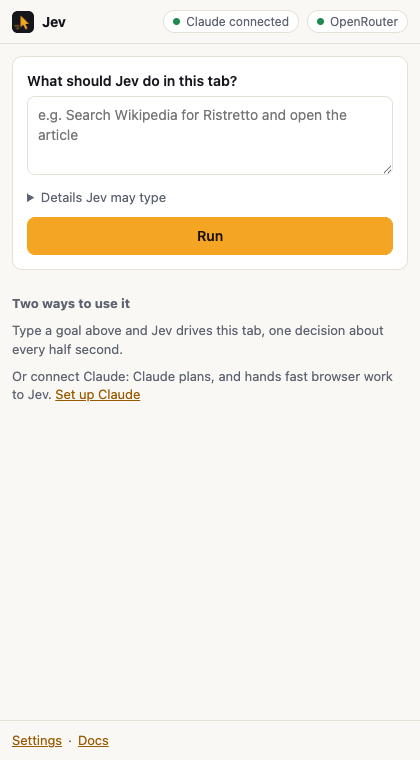

# Jev Browser Control

Let Claude or Codex drive a real Chrome. You ask in plain words; Claude plans, and [Jev](https://docs.typesafe.ai), TypeSafe's decision model, picks each click, keystroke and scroll in about half a second for a fraction of a cent.

Created by [Jeroen Erne](https://www.linkedin.com/in/jeroenerne/) ([nexibeo.com](https://nexibeo.com) · [completeaitraining.com](https://completeaitraining.com)), built together with Claude.

**Measured 27 to 198 times cheaper, and more than twice as fast, than letting Claude's or Codex's own model do the clicking** (same tasks, same loop; [results](#jev-vs-claude-and-codex-models)).

**Website:** [jevbrowsercontrol.com](https://jevbrowsercontrol.com) · **Docs:** [jevbrowsercontrol.com/docs](https://jevbrowsercontrol.com/docs) · **License:** MIT

## What you can ask

Five everyday tasks, run live in Claude Code on September 26, 2026:

| You ask Claude | What happens | Jev |
| --- | --- | --- |
| *Search Google for the Rijksmuseum opening hours* | Jev types the search; Claude reads you the answer (every day, 9:00 to 17:00) | 2 actions · 9.9 s · $0.0033 |
| *Research where the name "ristretto" comes from, on Wikipedia* | Jev searches Wikipedia and opens the article; Claude reads it and explains | 2 actions · 3.9 s · $0.0049 |
| *Draft a reply to the latest post on the TypeSafe LinkedIn page. Show me before you post.* | Jev opens the comment box and types the reply. Nothing is posted until you say so | 2 actions · 3.1 s · $0.0071 |
| *Get the transcript of my YouTube video "Future of Work" and summarise it* | Jev opens "Show transcript"; Claude reads the whole transcript and summarises it | 3 actions · 3.3 s · $0.0044 |
| *Order a large pizza with bacon for 19:30 on the test form. Stop before you submit.* | Jev fills in eight fields and stops before "Submit order" | 8 actions · 11.2 s · $0.0070 |

Costs are at the jevbrowsercontrol.com credits price (5× OpenRouter's); with your own OpenRouter key they are a fifth of that. Clicks that buy, pay, send, post or delete, and a Comment or Reply button that would publish what was typed, always stop and wait for your OK.

## Install

Needs Node.js 18+ and Google Chrome. Nothing to install in the browser: the MCP server opens its own Chrome window.

1. **Get a key.** Create one in the [dashboard](https://jevbrowsercontrol.com/dashboard) (prepaid credits, from $10), or use your own [OpenRouter key](https://openrouter.ai/settings/keys).
2. **Add the MCP server with your key.** Claude Code:

   ```bash
   claude mcp add -s user -e JBC_API_KEY=jbc_your_key jev-browser -- npx -y https://jevbrowsercontrol.com/downloads/jev-browser-control-mcp-0.4.0.tgz
   ```

   Codex:

   ```bash
   codex mcp add jev-browser --env JBC_API_KEY=jbc_your_key -- npx -y https://jevbrowsercontrol.com/downloads/jev-browser-control-mcp-0.4.0.tgz
   ```

   With your own OpenRouter key, use `OPENROUTER_API_KEY=sk-or-v1-...` instead. To keep the key out of Claude's and Codex's config, leave out `-e`/`--env` and put the same line in `~/.jev-browser-control/config.env`.
3. **Restart Claude Code or Codex and ask.** A Chrome window opens on first use. When a site needs a login, sign in there yourself once; the window has its own profile (`~/.jev-browser-control/chrome-profile`) and keeps the logins.

From a clone, `node scripts/install-agents.mjs` does all of this for Claude Code and Codex at once, and also installs a skill and a Claude Code subagent that know how to use the tools. Several Claude Code and Codex sessions share the one window; when the session that opened it ends, the next one takes over.

## What you get

- **An MCP server** for Claude Code, Codex and Claude Desktop, with 20 tools: `browser_navigate`, `browser_snapshot`, `browser_click`, `browser_type`, `browser_select`, `browser_hover` (menus that open on hover, like reaction pickers), `browser_read`, `browser_screenshot`, `browser_clipboard` (what a "Copy link" menu copied), `browser_record` (a screen recording of the browser, saved as MP4) and more, plus `jev_task` (hand a whole sub-task to Jev), `jev_find` and `jev_check`. By default it drives its own Chrome window through Playwright (browser mode).
- **A Chrome extension** (extension mode) for driving your everyday Chrome, with your normal profile and open tabs. It reads the page the same way and acts with trusted input. Run tasks from its side panel, or let Claude drive it.
- **Your choice of who pays for Jev:** your own OpenRouter key (free, this repo), prepaid credits from [jevbrowsercontrol.com](https://jevbrowsercontrol.com/dashboard) (one key, 5× OpenRouter's price), or any compatible endpoint such as TypeSafe direct.

> **Two editions, one codebase.** This repo is the open-source edition: load `extension/` and use your own OpenRouter key, credits, or a custom endpoint. The download on jevbrowsercontrol.com is the service edition, built from the same code with `lib/edition.js` set to `service`: it runs on credits only. `npm run zip` builds both (`dist/` and `dist/oss/`).

### Extension mode: your everyday Chrome



1. **Install the extension.** Clone this repo (or download the [zip](https://jevbrowsercontrol.com/downloads/jev-browser-control-extension.zip)), open `chrome://extensions`, switch on Developer mode, click **Load unpacked** and pick the `extension/` folder.
2. **Choose a provider** in the settings page that opens: paste an [OpenRouter key](https://openrouter.ai/settings/keys) or a `jbc_` credits key, and press **Test connection**.
3. **Connect Claude** in extension mode:

   ```bash
   claude mcp add -s user -e JBC_MODE=extension jev-browser -- node /path/to/jev-browser-control/mcp/server.mjs
   ```

   or `node scripts/install-agents.mjs --extension`. Claude Desktop: add `{"mcpServers": {"jev-browser": {"command": "node", "args": ["/path/to/mcp/server.mjs"], "env": {"JBC_MODE": "extension"}}}}` to its config.

**Grok Bot, ChatGPT, claude.ai and other cloud apps.** They can't start a local program, so jevbrowsercontrol.com offers the same tools as a remote MCP server at `https://jevbrowsercontrol.com/mcp` (bearer: your `jbc_` key). Switch on **Remote AI apps** in the extension's settings and the extension keeps an outbound connection to the relay; it's off by default, and clicks that buy, pay, send, post or delete always wait for your OK in the side panel. For Grok Bot there is a ready-made template: [Jev Browser Operator](https://templatesgrokbot.com/bot/jev-browser-operator).

**Claude Code and OpenAI Codex agent files.** [`agents/`](agents) has a skill (works in both) and a Claude Code subagent. `node scripts/install-agents.mjs` registers the MCP server and installs them for whichever of the two you have.

## How a step works

```
page ──► numbered elements ──► one Jev call ──► stop gates ──► trusted input ──► page
         (extension, ~20 ms)   (~0.5 s)         (code)          (CDP, ~50 ms)
```

1. **Snapshot.** Visible buttons, links and fields become rows `[n] role "label" value`, with checked/selected state and nearby card text. Password and file fields are never listed. Open shadow roots are included.
2. **One request, three answers.** Jev is asked for the operation (`CLICK`, `TYPE_TEXT`, `SELECT`, `PRESS_ENTER`, `SCROLL_*`, `BACK`, `WAIT`, `DONE`, `BLOCKED`), speculatively for the best target of *every* operation, and, independently, whether the goal is already met. Code uses only the target that matches the chosen operation.
3. **Stop gates in code.** `DONE` counts only when the independent goal check agrees; clicks that buy, pay, send, post or delete stop for confirmation, and so does a Comment, Reply or Send button next to a text box that holds text (it would publish it); three actions without a visible change end the run; limits on actions, seconds and dollars.
4. **Act.** Before input, the element is re-checked (same node, same state, visible, not covered). If the page moved while Jev decided, nothing is clicked and it looks again. Only `TYPE_TEXT` needs words: a small LLM writes them from the goal and never invents personal data (it returns `null`, and the task stops with `needs_input`).

Jev's answer is always an element number that code maps back to a node it tagged itself. It never becomes a selector, coordinates or code.

The operation-plus-speculative-target design, the freshness guards and the page snapshot are adapted from Browser Use's [Jev Ultrafast](https://github.com/browser-use/jev-ultrafast) (MIT); see [NOTICE](NOTICE).

## Measured

Live runs on September 19, 2026 with `typesafe/jev-1.13` (cost at OpenRouter prices; credits cost 5×):

| Task | Result | Actions | Time | Cost |
| --- | --- | --- | --- | --- |
| Wikipedia: search “Ristretto”, open the article | done, goal check 0.95 | 2 (4 Jev calls) | 4.9 s | $0.0018 |
| httpbin pizza form: 6 requested fields, no email given | filled all 6, then `needs_input` for the email | 7 (8 Jev calls) | 7.3 s | $0.0012 |
| Local pizza form with “then place the order” | filled 7 fields, stopped at `needs_confirmation` before “Place order” | 7 | 5.8 s | $0.0014 |
| `jev_find` “the checkbox for mushrooms” | Mushroom, p = 0.86 | – | 0.8 s | < $0.0002 |
| `jev_check` true / false statement | 0.97 / 0.01 | – | 0.9 s | < $0.0003 |

Recorded traces are in [`results/`](results).

### Jev vs. Claude and Codex models

[`scripts/benchmark.mjs`](scripts/benchmark.mjs) runs three live tasks (search Wikipedia and open an article; fill 7 fields of httpbin's order form without submitting; open the top Hacker News story's comments) through the same loop and page snapshot, changing only who answers each step's questions. With `--session`, the models run the way Claude Code and Codex run them: tool definitions in the system prompt, the whole conversation resent at every step, reasoning at medium effort, prompt caching on. Every model passed all three tasks; success is checked in code on the final page.

| Who picks each step | Total cost, 3 tasks | Time | Cost vs. Jev |
| --- | --- | --- | --- |
| Jev Browser Control, open source with your OpenRouter key | $0.0057 | 17.8 s | 1× |
| Jev Browser Control as a service (jevbrowsercontrol.com credits) | $0.028 | 17.8 s | 5× |
| GPT-5.3 Codex | $0.153 | 38.9 s | 27× |
| Claude Sonnet 5 | $0.249 | 43.3 s | 44× |
| Claude Opus 5 | $0.795 | 45.4 s | 140× |
| GPT-6 Astra | $1.129 | 38.3 s | 198× |

September 19, 2026, OpenRouter prices. Without `--session` (one bare call per step, reasoning off or low) the models cost about the same or less: $0.167, $0.247, $0.538 and $0.941. Prompt caching keeps the resent conversation cheap on short tasks like these; a long real session, which carries all its earlier work into every step, costs more. On Hacker News Jev reached the right page each time but its own goal check was unsure, so it ended as `stuck` or `done_unconfirmed` rather than `done`. Raw data: [`results/benchmark-session-2026-09-19.json`](results/benchmark-session-2026-09-19.json) and [`results/benchmark-2026-09-19.json`](results/benchmark-2026-09-19.json).

## Repository

| Path | What |
| --- | --- |
| `extension/` | Manifest V3 extension: `background.js` (router), `lib/agent.js` (the loop), `lib/policy.js` (questions), `lib/page.js` (in-page snapshot and input), `lib/driver.js` (Chrome and CDP), `lib/provider.js` (OpenRouter / credits / custom), side panel and settings |
| `mcp/` | MCP server: stdio JSON-RPC; browser mode in `lib/local-browser.mjs` (Playwright on the installed Chrome, running the loop from `lib/core/`, a copy of the extension's that `scripts/sync-core.mjs` keeps identical); extension mode through a small RFC 6455 WebSocket bridge on 127.0.0.1; peer mode so several sessions share one browser |
| `test/` | Unit tests (policy, agent loop, provider, bridge, MCP over stdio, core copy in sync), `e2e/browser-mode.mjs` (the server's own Chrome + MCP + live Jev), `e2e/run.mjs` (Chrome + extension + MCP + live Jev) and `e2e/remote.mjs` (the same through the jevbrowsercontrol.com relay) |
| `agents/` | A skill for Claude Code and Codex, and a Claude Code subagent |
| `scripts/` | `install-agents.mjs` (set up Claude Code and Codex), `build-zip.mjs` (release zip and npm tarball), `record-run.mjs` (record a task with every decision), `make-icons.mjs` |

```bash
npm install && npm install --prefix mcp   # playwright-core
npm test                    # 25 offline tests
OPENROUTER_API_KEY=... npm run e2e:browser            # browser mode, live, about $0.006
CHROME_PATH=... OPENROUTER_API_KEY=... npm run e2e    # extension mode, live, about $0.005
npm run zip                 # dist/ extension zips + MCP tarball
```

For `npm run e2e`, `CHROME_PATH` must be Chromium or Chrome for Testing: branded Chrome 137+ ignores `--load-extension`. Browser mode works with branded Chrome.

### MCP server settings

In browser mode these can go in `~/.jev-browser-control/config.env` (one `KEY=value` per line); the environment wins.

| Variable | Default | Meaning |
| --- | --- | --- |
| `JBC_MODE` | `browser` | `browser`: the server opens its own Chrome. `extension`: drive your Chrome through the extension |
| `OPENROUTER_API_KEY` / `JBC_API_KEY` | none | Browser mode: pay for Jev with your OpenRouter key, or with jevbrowsercontrol.com credits |
| `CHROME_PATH` | installed Chrome | Browser mode: a Chrome or Chromium binary; or `JBC_CHROME_CHANNEL` (`chrome`, `chrome-beta`, `msedge`) |
| `JBC_PROFILE_DIR` | `~/.jev-browser-control/chrome-profile` | Browser mode: the profile, kept between sessions |
| `JBC_HEADLESS` | `0` | Browser mode: `1` for no visible window |
| `JBC_MAX_STEPS`, `JBC_MAX_SECONDS`, `JBC_MAX_COST_USD` | `30`, `120`, `0.10` | Browser mode: limits per `jev_task` (actions, seconds, dollars) |
| `JBC_CONFIRM_IRREVERSIBLE` | `1` | Browser mode: `0` lets `jev_task` click buy/send/delete buttons without stopping |
| `JBC_BLOCKED_SITES` | none | Browser mode: comma-separated domains the browser may not open or act on |
| `JBC_JEV_MODEL`, `JBC_TEXT_MODEL` | `~typesafe/jev-latest`, `inception/mercury-2.5` | Browser mode: models |
| `JBC_PORT` | `10523` browser, `10522` extension | Bridge port (in extension mode, set the same port in the extension) |
| `JBC_EXTENSION_IDS` | any | Comma-separated extension IDs allowed to connect. The unpacked build's ID is `gnnidfbejejocmhhmjneoghkdkjpkbac` |
| `JBC_HOME` | `~/.jev-browser-control` | Where the peer token for other sessions lives |
| `JBC_DEBUG` | off | Log bridge events to stderr |

## Safety and limits

- Remote control is off until you switch it on. While it's on, anyone with that `jbc_` key can reach your browser through the relay, so keep the key secret and revoke it in the dashboard if it leaks. Remote callers can never skip the confirmation for irreversible clicks.
- The bridge listens on 127.0.0.1 only. Web pages can't connect (they can't forge a `chrome-extension://` origin); other MCP sessions need a token from your home folder.
- Browser mode uses its own profile, so it only has the logins you make in its window. Extension mode acts in your normal profile, with all your logins: use a separate Chrome profile for risky work. In both, list sites like your bank as blocked sites.
- Page text is sent to Jev as untrusted data, but prompt injection can still mislead a model. Keep limits on and check results; Jev can pick a confident near-miss between look-alike names.
- Not supported yet: cross-origin iframes, canvas apps, file uploads, CAPTCHAs, and hover-only menus. English pages work best.

## Credits

Created by [Jeroen Erne](https://www.linkedin.com/in/jeroenerne/) ([nexibeo.com](https://nexibeo.com) · [completeaitraining.com](https://completeaitraining.com)), built together with Claude. Loop design from [Jev Ultrafast](https://github.com/browser-use/jev-ultrafast) by Browser Use. Jev is a model by TypeSafe. This project is not affiliated with TypeSafe, Browser Use or Anthropic.
